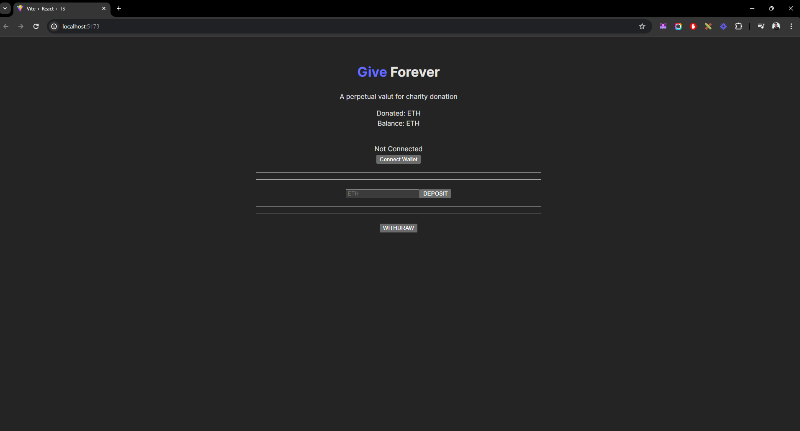

<h1 align='center'>GiveForever</h1>

<h1 align="center">
  
</h1>

## About 🚀

GiveForever is a revolutionary charity platform built on the power of Web3 technology, leveraging Solidity and React to create a transparent, secure, and efficient ecosystem for charitable donations. Our mission is to empower donors and charitable organizations by providing a decentralized platform that ensures every contribution is traceable and impactful.

With GiveForever, donors can directly connect with causes they care about, track their donations in real-time, and see the tangible results of their generosity. Using smart contracts written in Solidity, we ensure that funds are distributed exactly as intended, eliminating the need for intermediaries and reducing administrative costs.

Our React-based user interface offers a seamless and intuitive experience, making it easy for users to explore various charitable projects, contribute funds, and monitor the impact of their donations. Join us in transforming the way the world gives, making every donation count with GiveForever.

---

## Techs ✔
- [React JS](https://reactjs.org/)
- [Vite](https://vitejs.dev/)
- [Ethers](https://docs.ethers.org/v5/)
- [Solidity](https://soliditylang.org/)

---

## How to install 💻

```bash
#First clone this project on your preference path

$ git clone https://github.com/Luan4560/give-forever-web3

# Then got to you path, open the project and install the dependecies.

$ yarn or npm install

# After that, just initilialize the project with:

$ yarn dev
```
---